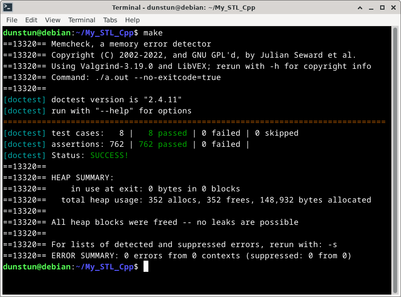

# My STL implementation (in progress!) 

---

## Contents

1. [Project idea](#project-idea)
2. [How To Build](#how-to-build)
3. [Run tests](#run-tests)
4. [TODO](#todo)

---

### Project idea

The main idea of implementing my own versions of some STL components as a learning project is to gain a deeper understanding of C++ programming, especially in areas like data structures, algorithms, and language features.

---

### How To Build

There is no need to build anything - it is header-only.
See `INC` variable in Makefile - you should put these dirs in your project.

---

### Run tests

This project uses [**doctest**](https://github.com/doctest/doctest) and [**valgrind**](https://valgrind.org/) for testing.

To run tests just write `make` command in your terminal (`valgrind` must be installed. If it is not there, then remove it from Makefile - line 24).

Example output:

---

### TODO

- **ADD MORE TESTS !!!**
- fix errors with iterators (esp. list's iterators, for example const - non-const conversion etc.).
- fix error in list - merge
- add shared_ptr and maps (with unoredered)
